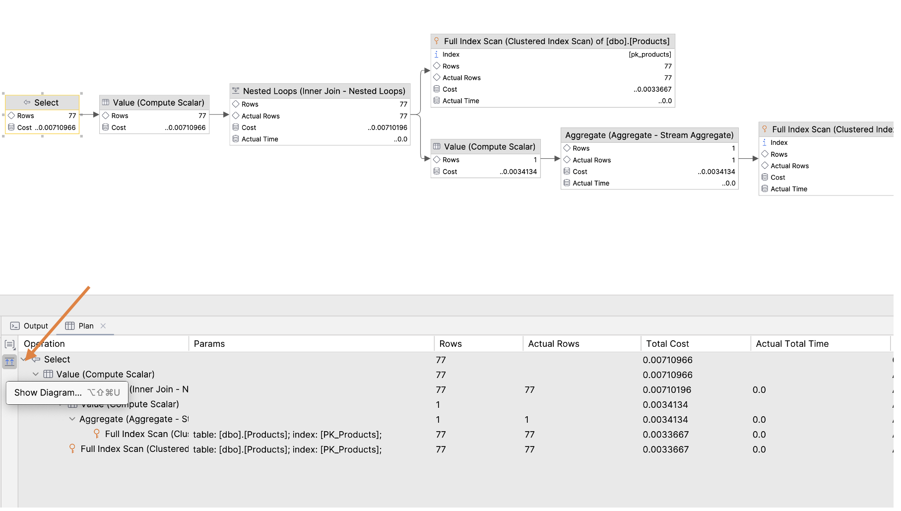
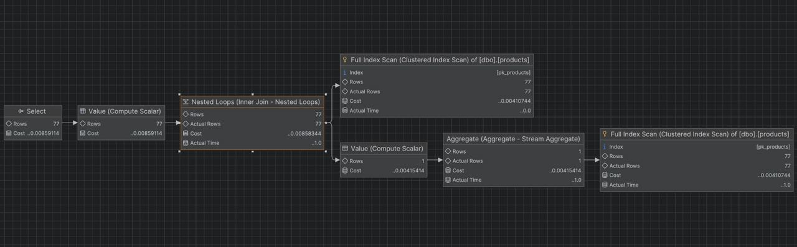
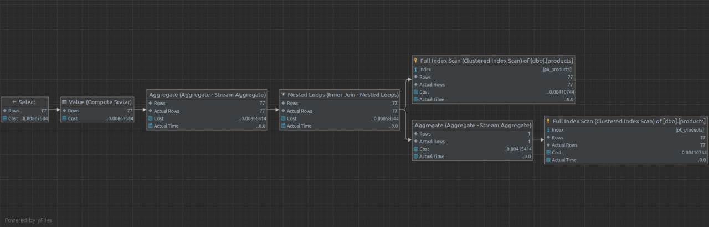
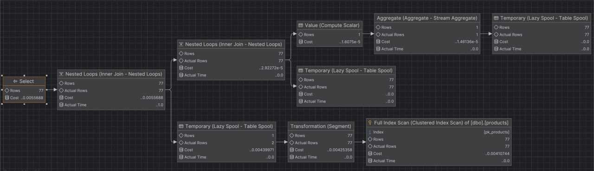
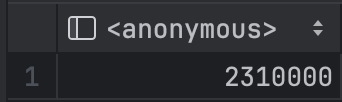
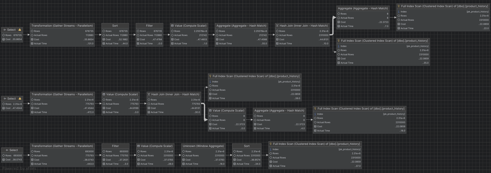
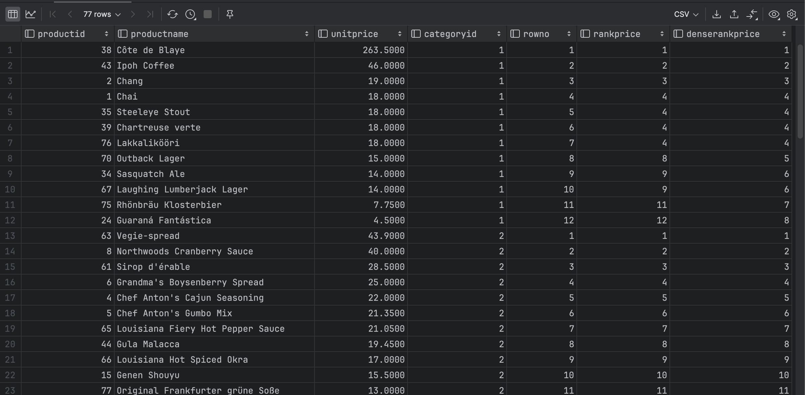
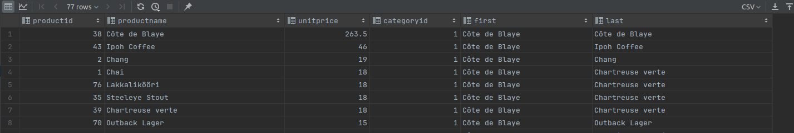

# SQL - Funkcje okna (Window functions) 

# Lab 1-2

---
**Imię i nazwisko:**
Wojciech Jasiński
Błażej Nowicki
Przemysław Węglik
--- 


Celem ćwiczenia jest zapoznanie się z działaniem funkcji okna (window functions) w SQL, analiza wydajności zapytań i porównanie z rozwiązaniami przy wykorzystaniu "tradycyjnych" konstrukcji SQL

Swoje odpowiedzi wpisuj w miejsca oznaczone jako:

```sql
-- wyniki ...
```

Ważne/wymagane są komentarze.

Zamieść kod rozwiązania oraz zrzuty ekranu pokazujące wyniki, (dołącz kod rozwiązania w formie tekstowej/źródłowej)

Zwróć uwagę na formatowanie kodu

---

## Oprogramowanie - co jest potrzebne?

Do wykonania ćwiczenia potrzebne jest następujące oprogramowanie:
- MS SQL Server - wersja 2019, 2022
- PostgreSQL - wersja 15/16
- SQLite
- Narzędzia do komunikacji z bazą danych
	- SSMS - Microsoft SQL Managment Studio
	- DtataGrip lub DBeaver
-  Przykładowa baza Northwind
	- W wersji dla każdego z wymienionych serwerów

Oprogramowanie dostępne jest na przygotowanej maszynie wirtualnej

## Dokumentacja/Literatura

- Kathi Kellenberger,  Clayton Groom, Ed Pollack, Expert T-SQL Window Functions in SQL Server 2019, Apres 2019
- Itzik Ben-Gan, T-SQL Window Functions: For Data Analysis and Beyond, Microsoft 2020

- Kilka linków do materiałów które mogą być pomocne
	 - https://learn.microsoft.com/en-us/sql/t-sql/queries/select-over-clause-transact-sql?view=sql-server-ver16
	- https://www.sqlservertutorial.net/sql-server-window-functions/
	- https://www.sqlshack.com/use-window-functions-sql-server/
	- https://www.postgresql.org/docs/current/tutorial-window.html
	- https://www.postgresqltutorial.com/postgresql-window-function/
	-  https://www.sqlite.org/windowfunctions.html
	- https://www.sqlitetutorial.net/sqlite-window-functions/

- Ikonki używane w graficznej prezentacji planu zapytania w SSMS opisane są tutaj:
	- [https://docs.microsoft.com/en-us/sql/relational-databases/showplan-logical-and-physical-operators-reference](https://docs.microsoft.com/en-us/sql/relational-databases/showplan-logical-and-physical-operators-reference)

---
# Zadanie 1 - obserwacja

Wykonaj i porównaj wyniki następujących poleceń.

```sql
select avg(unitprice) avgprice
from products p;

select avg(unitprice) over () as avgprice
from products p;

select categoryid, avg(unitprice) avgprice
from products p
group by categoryid

select avg(unitprice) over (partition by categoryid) as avgprice
from products p;
```

Jaka jest są podobieństwa, jakie różnice pomiędzy grupowaniem danych a działaniem funkcji okna?

```
1. Średnia dla wszystkich produktów.
2. Zapytanie używa funkcji okna, zwraca tę samą wartość liczbową co zapytanie nr 1, ale dodaje te wartość dla każdego produktu.
3. Zapytanie grupujące, oblicza średnią wartość dla każdej z grup, rozróżnianych przed categoryid.
4. Zapytanie używa funkcji okna. Od zapytania nr 2 odróżnia je to, że tym razem średnią liczymy na grupach produktów które łączy to samo categoryid (definiowane przez instrukcje partitionby). Wartości są zwracane dla każðego produktu podobnie jak w zapytaniu nr 2.
```
---
# Zadanie 2 - obserwacja

Wykonaj i porównaj wyniki następujących poleceń.

```sql
--1)

select p.productid, p.ProductName, p.unitprice,
       (select avg(unitprice) from products) as avgprice
from products p
where productid < 10

--2)
select p.productid, p.ProductName, p.unitprice,
       avg(unitprice) over () as avgprice
from products p
where productid < 10
```


Jaka jest różnica? Czego dotyczy warunek w każdym z przypadków?  
1) Napisz polecenie równoważne z wykorzystaniem funkcji okna. 
2) Napisz polecenie równoważne z wykorzystaniem podzapytania

```
Zapytanie nr 1 liczy średnią z cen wszystkich produktów. Zapytanie nr 2 liczy średnią tylko z cen produktów wybranych przez to zapytanie (czyli spełniających warunek z klauzuli WHERE).
```
```sql
-- Zapytanie nr 1 napisane przy pomocy funkcji okna:
-- w postgress i sqlite limit 10
select top 10 p.productid, p.ProductName, p.unitprice, 
    avg(unitprice) over () as avgprice 
from products p
order by productid

-- Zapytanie nr 2 napisane przy użyciu podzapytania:

select p.productid, p.ProductName, p.unitprice,
       (select avg(unitprice) from products where productid < 10) as avgprice
from products p
where productid < 10

```

# Zadanie 3

Baza: Northwind, tabela: products

Napisz polecenie, które zwraca: id produktu, nazwę produktu, cenę produktu, średnią cenę wszystkich produktów.

Napisz polecenie z wykorzystaniem z wykorzystaniem podzapytania, join'a oraz funkcji okna. Porównaj czasy oraz plany wykonania zapytań.

Przetestuj działanie w różnych SZBD (MS SQL Server, PostgreSql, SQLite)

W SSMS włącz dwie opcje: Include Actual Execution Plan oraz Include Live Query Statistics


W DataGrip użyj opcji Explain Plan/Explain Analyze





```sql
-- subquery
SELECT p.productid,
       p.ProductName,
       p.unitprice,
       (SELECT AVG(unitprice) FROM products) AS avgprice
FROM products p

-- window function
SELECT p.productid,
       p.ProductName,
       p.unitprice,
       AVG(unitprice) OVER () AS avgprice
FROM products p

-- join
SELECT p.productid,
       p.ProductName,
       p.unitprice,
       AVG(pp.unitprice) AS avgprice
FROM products p
         CROSS JOIN products pp
GROUP BY p.productid, p.ProductName, p.unitprice

```
Subquery:

Join:

Funkcja okna:


```
Funkcja okna ma najmniejszy koszt. Znajduje sie w niej jeden full index scan, którego koszt jest najwyższy.
```

---

# Zadanie 4

Baza: Northwind, tabela products

Napisz polecenie, które zwraca: id produktu, nazwę produktu, cenę produktu, średnią cenę produktów w kategorii, do której należy dany produkt. Wyświetl tylko pozycje (produkty) których cena jest większa niż średnia cena.

Napisz polecenie z wykorzystaniem podzapytania, join'a oraz funkcji okna. Porównaj zapytania. Porównaj czasy oraz plany wykonania zapytań.

Przetestuj działanie w różnych SZBD (MS SQL Server, PostgreSql, SQLite)

```sql
-- SQLites
-- subquery
SELECT p.ProductID,
       p.ProductName,
       p.UnitPrice,
       (SELECT AVG(pp.UnitPrice) FROM products pp WHERE pp.CategoryID == p.CategoryID) AS avgprice
FROM products p
    WHERE p.UnitPrice > avgprice

--join
SELECT p.ProductID,
       p.ProductName,
       p.UnitPrice,
       AVG(pp.unitprice) AS avgprice
FROM products p
        LEFT JOIN products pp ON pp.CategoryID = p.CategoryID
GROUP BY p.productid, p.ProductName, p.unitprice
HAVING p.UnitPrice > avgprice

--window function
SELECT *
FROM (SELECT p.ProductID,
             p.ProductName,
             p.UnitPrice,
             AVG(p.UnitPrice) OVER (PARTITION BY p.CategoryID)
                 AS avgprice
      FROM products p) t
WHERE t.UnitPrice > t.avgprice
```


---
# Zadanie 5 - przygotowanie

Baza: Northwind

Tabela products zawiera tylko 77 wiersz. Warto zaobserwować działanie na większym zbiorze danych.

Wygeneruj tabelę zawierającą kilka milionów (kilkaset tys.) wierszy

Stwórz tabelę o następującej strukturze:

Skrypt dla SQL Srerver

```sql
create table product_history(
   id int identity(1,1) not null,
   productid int,
   productname varchar(40) not null,
   supplierid int null,
   categoryid int null,
   quantityperunit varchar(20) null,
   unitprice decimal(10,2) null,
   quantity int,
   value decimal(10,2),
   date date,
 constraint pk_product_history primary key clustered
    (id asc )
)
```

Wygeneruj przykładowe dane:

Dla 30000 iteracji, tabela będzie zawierała nieco ponad 2mln wierszy (dostostu ograniczenie do możliwości swojego komputera)

Skrypt dla SQL Srerver

```sql
declare @i int  
set @i = 1  
while @i <= 30000  
begin  
    insert product_history  
    select productid, ProductName, SupplierID, CategoryID,   
         QuantityPerUnit,round(RAND()*unitprice + 10,2),  
         cast(RAND() * productid + 10 as int), 0,  
         dateadd(day, @i, '1940-01-01')  
    from products  
    set @i = @i + 1;  
end;  
  
update product_history  
set value = unitprice * quantity  
where 1=1;
```


Skrypt dla Postgresql

```sql
create table product_history(
   id int generated always as identity not null  
       constraint pkproduct_history
            primary key,
   productid int,
   productname varchar(40) not null,
   supplierid int null,
   categoryid int null,
   quantityperunit varchar(20) null,
   unitprice decimal(10,2) null,
   quantity int,
   value decimal(10,2),
   date date
);
```

Wygeneruj przykładowe dane:

Skrypt dla Postgresql

```sql
do $$  
begin  
  for cnt in 1..30000 loop  
    insert into product_history(productid, productname, supplierid,   
           categoryid, quantityperunit,  
           unitprice, quantity, value, date)  
    select productid, productname, supplierid, categoryid,   
           quantityperunit,  
           round((random()*unitprice + 10)::numeric,2),  
           cast(random() * productid + 10 as int), 0,  
           cast('1940-01-01' as date) + cnt  
    from products;  
  end loop;  
end; $$;  
  
update product_history  
set value = unitprice * quantity  
where 1=1;
```


Wykonaj polecenia: `select count(*) from product_history`,  potwierdzające wykonanie zadania


```sql
select count(*) from product_history
--- wynik był taki sam w każdym systemie:
2310000
```




---
# Zadanie 6

Baza: Northwind, tabela product_history

To samo co w zadaniu 3, ale dla większego zbioru danych

Napisz polecenie, które zwraca: id pozycji, id produktu, nazwę produktu, cenę produktu, średnią cenę produktów w kategorii do której należy dany produkt. Wyświetl tylko pozycje (produkty) których cena jest większa niż średnia cena.

Napisz polecenie z wykorzystaniem podzapytania, join'a oraz funkcji okna. Porównaj zapytania. Porównaj czasy oraz plany wykonania zapytań.

Przetestuj działanie w różnych SZBD (MS SQL Server, PostgreSql, SQLite)

🧠❓Wyniki przeanalizowano na następujących zapytaniach:
```sql
-- join
select p.productid, p.ProductName, p.unitprice, avg(pp.unitprice) as AvgCatPrice
from product_history p
         join product_history pp on p.categoryid = pp.categoryid
group by p.productid, p.ProductName, p.unitprice
having avg(pp.unitprice) < p.unitprice
order by p.productid

-- subquery
select *
from (select p.productid,
             p.ProductName,
             p.unitprice,
             (select avg(pp.unitprice)
              from product_history pp
              where pp.categoryid = p.categoryid) as avg_price_in_category
      from product_history p) t
where t.unitprice > t.avg_price_in_category

-- window function
select *
from (select p.productid,
             p.ProductName,
             p.unitprice,
             avg(p.unitprice) over (partition by p.categoryid) as avg_price_in_category
      from product_history p) t
where t.avg_price_in_category < t.unitprice
```



Przeprowadzono analizy w postgresql odpowiednio dla join'a, podzapytania i funkcji okna. Otrzymano następujące rezultaty:

| metoda       | koszt | czas[ms] |
|--------------|-------|----------|
| join         | 55.86 | 215      |
| podzapytanie | 47.45 | 770      |
| funkcja okna | 38.07 | 650      |

Według analizy plany dla joina i podzapytania wyglądają podobnie z dwoma operacjami 'Full Index Scan' kazdy. 
Róznia się miejscem agregacji gdzie jedna jest przed 'Hash Join' dla podzapytania a dla funkcji join po.
Pozdapytanie uzyskuje mniejszy sumaryczny koszt 47 w porównaniu do 55

Najbardziej optymalna z punktu widzenia analizy wydaje się funkcja okna gdzie 
robimy tylko jeden "Full Index Scan" a sumaryczny koszt wynosi 38

W praktyce pomiar czasu pokazuje ze join jest dwa razy szybszy niz pozostałe metody

Próby wykonania zapytań dla duzej tabeli product_history w dokerze dla postgresql i sqlite kończyły sie zawieszeniem baz. 
Połączenie sprawdzono i proste zapytania kończyły się sukcesem jak np select count(*) na tej samej tabeli. Dla sqlite brak efektu nawet jak zostawiłem zapytanie na 30min.

---
# Zadanie 7

Baza: Northwind, tabela product_history

Lekka modyfikacja poprzedniego zadania

Napisz polecenie, które zwraca: id pozycji, id produktu, nazwę produktu, cenę produktu oraz
-  średnią cenę produktów w kategorii do której należy dany produkt.
-  łączną wartość sprzedaży produktów danej kategorii (suma dla pola value)
-  średnią cenę danego produktu w roku którego dotyczy dana pozycja
- łączną wartość sprzedaży produktów danej kategorii (suma dla pola value)

Napisz polecenie z wykorzystaniem podzapytania, join'a oraz funkcji okna. Porównaj zapytania. W przypadku funkcji okna spróbuj użyć klauzuli WINDOW.

Porównaj czasy oraz plany wykonania zapytań.

Przetestuj działanie w różnych SZBD (MS SQL Server, PostgreSql, SQLite)


```sql
--funkcja okna
select id,
       productid,
       productname,
       unitprice,
       avg(unitprice) over (partition by categoryid),
       sum(value) over (partition by categoryid),
       avg(unitprice) over (partition by year(date)), -- / datepart('year', date) / strftime('%Y', date)
       sum(value) over (partition by year(date)) -- / datepart('year', date) / strftime('%Y', date)
from product_history

--podzapytanie
select p.id,
       p.productid,
       p.productname,
       p.unitprice,
       (select avg(pp.unitprice) as avg_price_in_cat
        from product_history pp
        where pp.categoryid = p.categoryid),
       (select sum(pp.value)
        from product_history pp
        where pp.categoryid = p.categoryid),
       (select avg(pp.unitprice) as avg_price_in_year
        from product_history pp
        where year(pp.date) = year(p.date)), -- ...
       (select sum(pp.value) as total_value_in_year
        from product_history pp
        where year(pp.date) = year(p.date)) -- ...
from product_history p

--join
select p.id,
       p.productid,
       p.productname,
       p.unitprice,
       avg(pc.unitprice),
       sum(pc.value),
       avg(py.unitprice),
       sum(py.value)
from product_history p
         join product_history pc on p.categoryid = pc.categoryid
         join product_history py on year(p.date) = year(p.date)
where p.id < 1000
  and pc.id < 1000
  and py.id < 1000
group by p.id, p.productid, p.productname, p.unitprice
```
#### SQL Server

Funkcja okna - 4s


Przeprowadza tylko jeden index scan. Szybka i prosty plan wykonania

Podzapytania - 4s


Skomplikowany plan wykonania ale szybka. Przeprowadza wiele skanów bazy ale kazdy mocno ograniczony

Join - DNF


Liczba operacji rzędu długości tabeli ^3. Próba 15 minutowa na pełnej tabeli. Widac za to ze sql server zrównolegla zapytania i dobrze wykorzystuje zasoby.


Plan operacji udało sie wykonać tylko po dodatkowych klauzlach where < n na id w tabelach

#### Postgres

Funkcja okna - 1.5s

Podzapytanie - DNF

Join - DNF

Słabiej optymalizowane podzapytania. Za to funcja okna okazała sie znacznie szybsza niz w sql server
Podejrzewana złozonosc dla podzapytania i joina to n^3.

#### SQlite

Funkcja okna - 3s

Podzapytanie - DNF

Join - DNF

Podobnie jak w przypadku postgresql.
Słabiej optymalizowane podzapytania. Szybka funkcja okna.
Podejrzewana złozonosc dla podzapytania i joina to n^3.

---
# Zadanie 8 - obserwacja

Funkcje rankingu, `row_number()`, `rank()`, `dense_rank()`

Wykonaj polecenie, zaobserwuj wynik. Porównaj funkcje row_number(), rank(), dense_rank()

```sql 
select productid, productname, unitprice, categoryid,  
    row_number() over(partition by categoryid order by unitprice desc) as rowno,  
    rank() over(partition by categoryid order by unitprice desc) as rankprice,  
    dense_rank() over(partition by categoryid order by unitprice desc) as denserankprice  
from products;
```


Podzapytania róznią się dla takich samych wartości w kolumnie. 

`row_number` sortuje po unit price i numeruje wiersze

`rank` sortuje po unit price ale dla takich samych wartości przypisuje ten sam numer.
Dla kolejnych wartości wraca do normalnej numeracji zachowując przerwę

`dense_rank` tak samo jak rank tylko nie zachowuje przerwy po takich samych elementach


Zadanie

Spróbuj uzyskać ten sam wynik bez użycia funkcji okna

🔥🔥🔥
```sql
select p.productid,
       p.productname,
       p.unitprice,
       p.categoryid,
       -- row_number() jest niederministyczne więc taka implementacja zadziała tylko jak dodamy odpowiedni order by
       (select count(pp.productid) + 1 as q
        from products pp
        where (pp.categoryid = p.categoryid and pp.unitprice > p.unitprice)
           or (pp.categoryid = p.categoryid and pp.unitprice = p.unitprice and pp.productid < p.productid)) as rowno,
       -- działa zawsze
       (select count(pp.productid) + 1
        from products pp
        where pp.categoryid = p.categoryid
          and pp.unitprice > p.unitprice)                                                                   as rankprice,
       -- działa zawsze
       (select count(t.q) + 1
        from (select distinct pp.unitprice as q
              from products pp
              where pp.categoryid = p.categoryid
                and pp.unitprice > p.unitprice) t)                                                          as denserankprice
from products p
order by p.categoryid, p.unitprice desc, p.productid
```


---
# Zadanie 9

Baza: Northwind, tabela product_history

Dla każdego produktu, podaj 4 najwyższe ceny tego produktu w danym roku. Zbiór wynikowy powinien zawierać:
- rok
- id produktu
- nazwę produktu
- cenę
- datę (datę uzyskania przez produkt takiej ceny)
- pozycję w rankingu

Uporządkuj wynik wg roku, nr produktu, pozycji w rankingu

```sql
--- wyniki ...
```


Spróbuj uzyskać ten sam wynik bez użycia funkcji okna, porównaj wyniki, czasy i plany zapytań. Przetestuj działanie w różnych SZBD (MS SQL Server, PostgreSql, SQLite)


```sql
--- wyniki ...
```

---
# Zadanie 10 - obserwacja

Funkcje `lag()`, `lead()`

Wykonaj polecenia, zaobserwuj wynik. Jak działają funkcje `lag()`, `lead()`

```sql
select productid, productname, categoryid, date, unitprice,  
       lag(unitprice) over (partition by productid order by date)   
as previousprodprice,  
       lead(unitprice) over (partition by productid order by date)   
as nextprodprice  
from product_history  
where productid = 1 and year(date) = 2022  
order by date;  
  
with t as (select productid, productname, categoryid, date, unitprice,  
                  lag(unitprice) over (partition by productid   
order by date) as previousprodprice,  
                  lead(unitprice) over (partition by productid   
order by date) as nextprodprice  
           from product_history  
           )  
select * from t  
where productid = 1 and year(date) = 2022  
order by date;
```

```sql
-- wyniki ...
```


Zadanie

Spróbuj uzyskać ten sam wynik bez użycia funkcji okna, porównaj wyniki, czasy i plany zapytań. Przetestuj działanie w różnych SZBD (MS SQL Server, PostgreSql, SQLite)

```sql
-- wyniki ...
```

---
# Zadanie 11

Baza: Northwind, tabele customers, orders, order details

Napisz polecenie które wyświetla inf. o zamówieniach

Zbiór wynikowy powinien zawierać:
- nazwę klienta, nr zamówienia,
- datę zamówienia,
- wartość zamówienia (wraz z opłatą za przesyłkę),
- nr poprzedniego zamówienia danego klienta,
- datę poprzedniego zamówienia danego klienta,
- wartość poprzedniego zamówienia danego klienta.

```sql
-- wyniki ...
```


---
# Zadanie 12 - obserwacja

Funkcje `first_value()`, `last_value()`

Wykonaj polecenia, zaobserwuj wynik. Jak działają funkcje `first_value()`, `last_value()`. Skomentuj uzyskane wyniki. Czy funkcja `first_value` pokazuje w tym przypadku najdroższy produkt w danej kategorii, czy funkcja `last_value()` pokazuje najtańszy produkt? Co jest przyczyną takiego działania funkcji `last_value`. Co trzeba zmienić żeby funkcja last_value pokazywała najtańszy produkt w danej kategorii

```sql
select productid, productname, unitprice, categoryid,  
    first_value(productname) over (partition by categoryid   
order by unitprice desc) first,  
    last_value(productname) over (partition by categoryid   
order by unitprice desc) last  
from products  
order by categoryid, unitprice desc;
```



```
Funkcje okna mają zasięg działania (RANGE). Jeśli używamy ORDER BY i nie podamy RANGE to domyślne wartości to:
RANGE BETWEEN UNBOUNDED PRECEDING AND CURRENT ROW. Oznacza to, że wybierzemy najmniejszą wartość między pierwszym, a obecnym wierszem tabeli. W zadaniu ponieważ mamy tam klauzulę: order by categoryid, unitprice desc to tabel już jest posortowana po cenie, daltego otrzyujemy zawsze przedmiot z obecnego wierszu (jest najtańszy w oknie)
Prawidłowo napisane zapytanie będzie wyglądać tak:
```

```sql
SELECT productid,
       productname,
       unitprice,
       categoryid,
       FIRST_VALUE(productname) OVER (PARTITION BY categoryid
           ORDER BY unitprice DESC)                                                            first,
       LAST_VALUE(productname) OVER (PARTITION BY categoryid
           ORDER BY unitprice DESC RANGE BETWEEN UNBOUNDED PRECEDING AND UNBOUNDED FOLLOWING) last
FROM products
ORDER BY categoryid, unitprice DESC;
```


Zadanie

Spróbuj uzyskać ten sam wynik bez użycia funkcji okna, porównaj wyniki, czasy i plany zapytań. Przetestuj działanie w różnych SZBD (MS SQL Server, PostgreSql, SQLite)

```sql
-- wyniki ...
```

---
# Zadanie 13

Baza: Northwind, tabele orders, order details

Napisz polecenie które wyświetla inf. o zamówieniach

Zbiór wynikowy powinien zawierać:
- Id klienta,
- nr zamówienia,
- datę zamówienia,
- wartość zamówienia (wraz z opłatą za przesyłkę),
- dane zamówienia klienta o najniższej wartości w danym miesiącu
	- nr zamówienia o najniższej wartości w danym miesiącu
	- datę tego zamówienia
	- wartość tego zamówienia
- dane zamówienia klienta o najwyższej wartości w danym miesiącu
	- nr zamówienia o najniższej wartości w danym miesiącu
	- datę tego zamówienia
	- wartość tego zamówienia

```sql
--- wyniki ...
```

---
# Zadanie 14

Baza: Northwind, tabela product_history

Napisz polecenie które pokaże wartość sprzedaży każdego produktu narastająco od początku każdego miesiąca. Użyj funkcji okna

Zbiór wynikowy powinien zawierać:
- id pozycji
- id produktu
- datę
- wartość sprzedaży produktu w danym dniu
- wartość sprzedaży produktu narastające od początku miesiąca

```sql
-- wyniki ...
```

Spróbuj wykonać zadanie bez użycia funkcji okna. Spróbuj uzyskać ten sam wynik bez użycia funkcji okna, porównaj wyniki, czasy i plany zapytań. Przetestuj działanie w różnych SZBD (MS SQL Server, PostgreSql, SQLite)

```sql
-- wyniki ...
```

---
# Zadanie 15

Wykonaj kilka "własnych" przykładowych analiz. Czy są jeszcze jakieś ciekawe/przydatne funkcje okna (z których nie korzystałeś w ćwiczeniu)? Spróbuj ich użyć w zaprezentowanych przykładach.

```sql
-- wyniki ...
```


Punktacja

|         |     |
| ------- | --- |
| zadanie | pkt |
| 1       | 0,5 |
| 2       | 0,5 |
| 3       | 1   |
| 4       | 1   |
| 5       | 0,5 |
| 6       | 2   |
| 7       | 2   |
| 8       | 0,5 |
| 9       | 2   |
| 10      | 1   |
| 11      | 2   |
| 12      | 1   |
| 13      | 2   |
| 14      | 2   |
| 15      | 2   |
| razem   | 20  |
