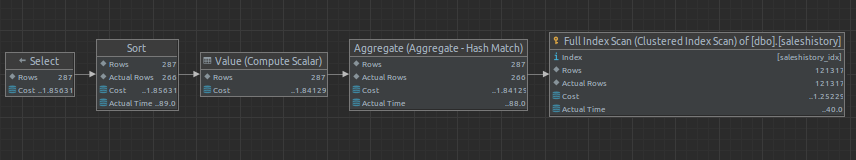
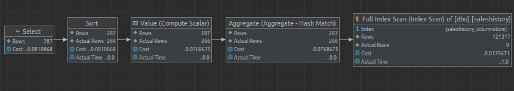

# Indeksy,  optymalizator <br>Lab 6-7

<!-- <style scoped>
 p,li {
    font-size: 12pt;
  }
</style>  -->

<!-- <style scoped>
 pre {
    font-size: 8pt;
  }
</style>  -->


---

**Imię i nazwisko:**

--- 

Celem ćwiczenia jest zapoznanie się z planami wykonania zapytań (execution plans), oraz z budową i możliwością wykorzystaniem indeksów (cz. 2.)

Swoje odpowiedzi wpisuj w miejsca oznaczone jako:

---
> Wyniki: 

```sql
--  ...
```

---

Ważne/wymagane są komentarze.

Zamieść kod rozwiązania oraz zrzuty ekranu pokazujące wyniki, (dołącz kod rozwiązania w formie tekstowej/źródłowej)

Zwróć uwagę na formatowanie kodu

## Oprogramowanie - co jest potrzebne?

Do wykonania ćwiczenia potrzebne jest następujące oprogramowanie
- MS SQL Server,
- SSMS - SQL Server Management Studio    
- przykładowa baza danych AdventureWorks2017.
    
Oprogramowanie dostępne jest na przygotowanej maszynie wirtualnej

## Przygotowanie  


    
Stwórz swoją bazę danych o nazwie lab6. 

```sql
create database lab5  
go  
  
use lab5  
go
```

## Dokumentacja

Obowiązkowo:
- [https://docs.microsoft.com/en-us/sql/relational-databases/indexes/indexes](https://docs.microsoft.com/en-us/sql/relational-databases/indexes/indexes)
- [https://docs.microsoft.com/en-us/sql/relational-databases/indexes/create-filtered-indexes](https://docs.microsoft.com/en-us/sql/relational-databases/indexes/create-filtered-indexes)

# Zadanie 1

Skopiuj tabelę Product do swojej bazy danych:

```sql
select * into product from adventureworks2017.production.product
```

Stwórz indeks z warunkiem przedziałowym:

```sql
create nonclustered index product_range_idx  
    on product (productsubcategoryid, listprice) include (name)  
where productsubcategoryid >= 27 and productsubcategoryid <= 36
```

Sprawdź, czy indeks jest użyty w zapytaniu:

```sql
select name, productsubcategoryid, listprice  
from product  
where productsubcategoryid >= 27 and productsubcategoryid <= 36
```

Sprawdź, czy indeks jest użyty w zapytaniu, który jest dopełnieniem zbioru:

```sql
select name, productsubcategoryid, listprice  
from product  
where productsubcategoryid < 27 or productsubcategoryid > 36
```


Skomentuj oba zapytania. Czy indeks został użyty w którymś zapytaniu, dlaczego? Czy indeks nie został użyty w którymś zapytaniu, dlaczego? Jak działają indeksy z warunkiem?


---
> Wyniki: 

```sql
Indeks został użyty w zapytaniu pierwszym, ale nie w zapytaniu drugim. Aby skorzystać z "filtered" indeksu warunek z klauzuli WHERE zapytania musi być podzbiorem z klauzuli WHERE indeksu.
```


# Zadanie 2 – indeksy klastrujące

Celem zadania jest poznanie indeksów klastrujących!

Skopiuj ponownie tabelę SalesOrderHeader do swojej bazy danych:

```sql
select * into salesorderheader2 from adventureworks2017.sales.salesorderheader
```


Wypisz sto pierwszych zamówień:

```sql
select top 1000 * from salesorderheader2  
order by orderdate
```

Stwórz indeks klastrujący według OrderDate:

```sql
create clustered index order_date2_idx on salesorderheader2(orderdate)
```

Wypisz ponownie sto pierwszych zamówień. Co się zmieniło?

---
> Wyniki: 

```sql
Po dodaniu indeksu, ID zamówień zostały posortowane rosnąco, bez niego malejąco.
```


Sprawdź zapytanie:

```sql
select top 1000 * from salesorderheader2  
where orderdate between '2010-10-01' and '2011-06-01'
```


Dodaj sortowanie według OrderDate ASC i DESC. Czy indeks działa w obu przypadkach. Czy wykonywane jest dodatkowo sortowanie?


---
> Wyniki: 

```sql
Sortowanie nie jest wykonywane w żadnym przypadku co sugeruje, że dane są już posortowane wg OrderDate, potem wystarczy zwrócić je w odpowiedniej kolejności (tak jak w indeksie, lub na odwrót)
```


# Zadanie 3 – indeksy column store


Celem zadania jest poznanie indeksów typu column store!

Utwórz tabelę testową:

```sql
create table dbo.saleshistory(  
 salesorderid int not null,  
 salesorderdetailid int not null,  
 carriertrackingnumber nvarchar(25) null,  
 orderqty smallint not null,  
 productid int not null,  
 specialofferid int not null,  
 unitprice money not null,  
 unitpricediscount money not null,  
 linetotal numeric(38, 6) not null,  
 rowguid uniqueidentifier not null,  
 modifieddate datetime not null  
 )
```

Załóż indeks:

```sql
create clustered index saleshistory_idx  
on saleshistory(salesorderdetailid)
```


Wypełnij tablicę danymi:

(UWAGA    `GO 100` oznacza 100 krotne wykonanie polecenia. Jeżeli podejrzewasz, że Twój serwer może to zbyt przeciążyć, zacznij od GO 10, GO 20, GO 50 (w sumie już będzie 80))

```sql
insert into saleshistory  
 select sh.*  
 from adventureworks2017.sales.salesorderdetail sh  
go 100
```

Sprawdź jak zachowa się zapytanie, które używa obecny indeks:

```sql
select productid, sum(unitprice), avg(unitprice), sum(orderqty), avg(orderqty)  
from saleshistory  
group by productid  
order by productid
```

Załóż indeks typu ColumnStore:

```sql
create nonclustered columnstore index saleshistory_columnstore  
 on saleshistory(unitprice, orderqty, productid)
```

Sprawdź różnicę pomiędzy przetwarzaniem w zależności od indeksów. Porównaj plany i opisz różnicę.


---
> Wyniki: 
Tylko indeks klastrowany

Indeks nie klastrowany


```sql
Plany są identyczne, z tą różnicą, że podczas "Full index scan" przed dodaniem indeksu nie klastrowanego przejrzano faktycznie wszystkie wiersze ("actual rows"). Po dodaniu indeksu nie klastrowanego ta liczba wynosi 0. W drugim przypadku koszt i czas są dużo niższe.
```

# Zadanie 4 – własne eksperymenty

Należy zaprojektować tabelę w bazie danych, lub wybrać dowolny schemat danych (poza używanymi na zajęciach), a następnie wypełnić ją danymi w taki sposób, aby zrealizować poszczególne punkty w analizie indeksów. Warto wygenerować sobie tabele o większym rozmiarze.

Do analizy, proszę uwzględnić następujące rodzaje indeksów:
- Klastrowane (np.  dla atrybutu nie będącego kluczem głównym)
- Nieklastrowane
- Indeksy wykorzystujące kilka atrybutów, indeksy include
- Filtered Index (Indeks warunkowy)
- Kolumnowe

## Analiza

Proszę przygotować zestaw zapytań do danych, które:
- wykorzystują poszczególne indeksy
- które przy wymuszeniu indeksu działają gorzej, niż bez niego (lub pomimo założonego indeksu, tabela jest w pełni skanowana)
Odpowiedź powinna zawierać:
- Schemat tabeli
- Opis danych (ich rozmiar, zawartość, statystyki)
- Trzy indeksy:
- Opis indeksu
- Przygotowane zapytania, wraz z wynikami z planów (zrzuty ekranow)
- Komentarze do zapytań, ich wyników
- Sprawdzenie, co proponuje Database Engine Tuning Advisor (porównanie czy udało się Państwu znaleźć odpowiednie indeksy do zapytania)


> Wyniki: 

Do eksperymentów wykorzystaliśmy bazę danych "Wide World Importers" - podobną do AdventureWorks.


>1. Klastrowane dla atrybutu nie będącego kluczem głównym
>
>
>```sql
>SELECT * FROM Sales.Orders WHERE OrderDate BETWEEN '2013-01-03' AND '2013-01-04';
>```
>
>
>
>
>
>Wykonujemy zapytanie dla przedziału dat - mimo że niby powinny w tabeli być ułożone chronologicznie, to >potrzebujemy clustered index na dacie, żeby zapytania z przedziałem dat faktycznie były szybsze.
>
>```sql
>CREATE CLUSTERED INDEX IX_Orders_OrderDate ON Sales.Orders(OrderDate);
>```
>


>2. Nieklastrowany indeks
>
>Przykładowy indeks nieklastrowany założony na kolumnę z nazwą. Pomaga przy wyszukiwaniu po nazwie.
>```sql
>SELECT StockItemID, StockItemName FROM Warehouse.StockItems WHERE StockItemName LIKE '%wheel%';
>```
>
>
>```sql
>CREATE NONCLUSTERED INDEX IX_StockItems_StockItemName ON Warehouse.StockItems(StockItemName);
>```
>

>3. Indeksy wykorzystujące kilka atrybutów, indeksy include
>
>Zakładając indeks na datę, supplierID możemy zoptymalizować poniższe zapytanie. Dodatkowo includując >TransactionAmount posiadamy wszystkie interesujące nas pola w indeksie i nie musimy robić lookupu. 
>```sql
>SELECT SupplierID, TransactionDate, TransactionAmount
>FROM Purchasing.SupplierTransactions
>WHERE SupplierID = 4 AND TransactionDate BETWEEN '2013-01-01' AND '2013-01-31';
>```
>
>
>
>```sql
>CREATE NONCLUSTERED INDEX IX_SupplierTransactions_Date_SupplierID_IncludeAmount 
>ON Purchasing.SupplierTransactions(TransactionDate, SupplierID)
>INCLUDE (TransactionAmount);
>```
>


>4. Filtered Index
>
>Jeśli transakcji w systemie pojawia się bardzo dużo, kosztownym może być utrzymywanie indeksu. Możemy >ograniczyć indeks do transakcji o dużych wartościach - te powinny nas bardziej interesować.
>```sql
>SELECT CustomerTransactionID, CustomerID, TransactionDate, TransactionAmount
>FROM Sales.CustomerTransactions
>WHERE TransactionAmount > 10000;
>```
>
>
>
>```sql
>CREATE NONCLUSTERED INDEX IX_CustomerTransactions_HighValue
>ON Sales.CustomerTransactions (CustomerTransactionID)
>INCLUDE (CustomerID, TransactionDate, TransactionAmount)
>WHERE TransactionAmount > 15000; 
>```
>

>5. Kolumnowe indeks
>
>Zapytanie jak to potrzebne jest do obliczenia agregatów jak przychody czy coś. Kolumnowy indeks pomaga w tym.
>```sql
>SELECT OrderID, SUM(Quantity * UnitPrice) AS TotalAmount
>FROM Sales.OrderLines
>GROUP BY OrderID
>HAVING SUM(Quantity * UnitPrice) > 10000;
>```
>
>
>
>
>```sql
>CREATE NONCLUSTERED COLUMNSTORE INDEX IX_OrderLines_ColumnStore ON Sales.OrderLines
>(OrderLineID, OrderID, Quantity, UnitPrice);
>```
>


|         |     |     |     |
| ------- | --- | --- | --- |
| zadanie | pkt |     |     |
| 1       | 2   |     |     |
| 2       | 2   |     |     |
| 3       | 2   |     |     |
| 4       | 10  |     |     |
| razem   | 16  |     |     |
