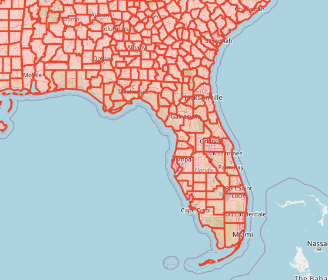

# Raport

# Przetwarzanie i analiza danych przestrzennych 
# Oracle spatial


---

**Imiona i nazwiska:**

--- 

Celem ćwiczenia jest zapoznanie się ze sposobem przechowywania, przetwarzania i analizy danych przestrzennych w bazach danych
(na przykładzie systemu Oracle spatial)

Swoje odpowiedzi wpisuj w miejsca oznaczone jako:

---
> Wyniki, zrzut ekranu, komentarz

```sql
--  ...
```

---

Do wykonania ćwiczenia (zadania 1 – 7) i wizualizacji danych wykorzystaj Oracle SQL Develper. Alternatywnie możesz wykonać analizy w środowisku Python/Jupyter Notebook

Do wykonania zadania 8 wykorzystaj środowisko Python/Jupyter Notebook

Raport należy przesłać w formacie pdf.

Należy też dołączyć raport zawierający kod w formacie źródłowym.

Np.
- plik tekstowy .sql z kodem poleceń
- plik .md zawierający kod wersji tekstowej
- notebook programu jupyter – plik .ipynb

Zamieść kod rozwiązania oraz zrzuty ekranu pokazujące wyniki, (dołącz kod rozwiązania w formie tekstowej/źródłowej)

Zwróć uwagę na formatowanie kodu

<div style="page-break-after: always;"></div>

# Zadanie 1

Zwizualizuj przykładowe dane

US_STATES


> Wyniki, zrzut ekranu, komentarz


```sql
SELECT  sdo_util.to_wktgeometry(geom)
       FROM us_states
```


US_INTERSTATES


> Wyniki, zrzut ekranu, komentarz

```sql
SELECT  sdo_util.to_wktgeometry(geom)
       FROM us_interstates
```


US_CITIES


> Wyniki, zrzut ekranu, komentarz

```sql
SELECT  sdo_util.to_wktgeometry(location)
       FROM us_cities
```


US_RIVERS


> Wyniki, zrzut ekranu, komentarz

```sql
SELECT  sdo_util.to_wktgeometry(geom)
       FROM us_rivers
```


US_COUNTIES


> Wyniki, zrzut ekranu, komentarz

```sql
SELECT  sdo_util.to_wktgeometry(geom)
       FROM us_countie
```



US_PARKS


> Wyniki, zrzut ekranu, komentarz

```sql
SELECT  sdo_util.to_wktgeometry(geom)
       FROM us_parks where id < 500
```


# Zadanie 2

Znajdź wszystkie stany (us_states) których obszary mają część wspólną ze wskazaną geometrią (prostokątem)

Pokaż wynik na mapie.

prostokąt

```sql
SELECT  sdo_geometry (2003, 8307, null,
sdo_elem_info_array (1,1003,3),
sdo_ordinate_array ( -117.0, 40.0, -90., 44.0)) g
FROM dual
```


> Wyniki, zrzut ekranu, komentarz

```sql
--  ...
```


Użyj funkcji SDO_FILTER

```sql
SELECT state, geom FROM us_states
WHERE sdo_filter (geom,
sdo_geometry (2003, 8307, null,
sdo_elem_info_array (1,1003,3),
sdo_ordinate_array ( -117.0, 40.0, -90., 44.0))
) = 'TRUE';
```

Zwróć uwagę na liczbę zwróconych wierszy (16)


> Wyniki, zrzut ekranu, komentarz

```sql
--  ...
```


Użyj funkcji  SDO_ANYINTERACT

```sql
SELECT state, geom FROM us_states
WHERE sdo_anyinteract (geom,
sdo_geometry (2003, 8307, null,
sdo_elem_info_array (1,1003,3),
sdo_ordinate_array ( -117.0, 40.0, -90., 44.0))
) = 'TRUE';
```

Porównaj wyniki sdo_filter i sdo_anyinteract

Pokaż wynik na mapie


> Wyniki, zrzut ekranu, komentarz

```sql
--  ...
```

# Zadanie 3

Znajdź wszystkie parki (us_parks) których obszary znajdują się wewnątrz stanu Wyoming

Użyj funkcji SDO_INSIDE

```sql
SELECT p.name, p.geom
FROM us_parks p, us_states s
WHERE s.state = 'Wyoming'
AND SDO_INSIDE (p.geom, s.geom ) = 'TRUE';
```

W przypadku wykorzystywania narzędzia SQL Developer, w celu wizualizacji na mapie użyj podzapytania

```sql
SELECT pp.name, pp.geom  FROM us_parks pp
WHERE id IN
(
    SELECT p.id
    FROM us_parks p, us_states s
    WHERE s.state = 'Wyoming'
    and SDO_INSIDE (p.geom, s.geom ) = 'TRUE'
)
```


> Wyniki, zrzut ekranu, komentarz

```sql
SELECT sdo_util.to_wktgeometry(p.geom)
FROM us_parks p, us_states s
WHERE s.state = 'Wyoming'
AND SDO_INSIDE (p.geom, s.geom ) = 'TRUE'
```


Porównaj wynik z:

```sql
SELECT p.name, p.geom
FROM us_parks p, us_states s
WHERE s.state = 'Wyoming'
AND SDO_ANYINTERACT (p.geom, s.geom ) = 'TRUE';
```


### Wnioski
SDO_ANYINTERACT zwróci także parki, które nie są całkowicie wewnątrz innego obszaru, ale także takie które się z nim przecinają


# Zadanie 4

Znajdź wszystkie jednostki administracyjne (us_counties) wewnątrz stanu New Hampshire

```sql
SELECT c.county, c.state_abrv, c.geom
FROM us_counties c, us_states s
WHERE s.state = 'New Hampshire'
AND SDO_RELATE ( c.geom,s.geom, 'mask=INSIDE+COVEREDBY') = 'TRUE';

SELECT c.county, c.state_abrv, c.geom
FROM us_counties c, us_states s
WHERE s.state = 'New Hampshire'
AND SDO_RELATE ( c.geom,s.geom, 'mask=INSIDE') = 'TRUE';

SELECT c.county, c.state_abrv, c.geom
FROM us_counties c, us_states s
WHERE s.state = 'New Hampshire'
AND SDO_RELATE ( c.geom,s.geom, 'mask=COVEREDBY') = 'TRUE';
```

W przypadku wykorzystywania narzędzia SQL Developer, w celu wizualizacji danych na mapie należy użyć podzapytania (podobnie jak w poprzednim zadaniu)


> Wyniki, zrzut ekranu, komentarz

```sql
--  ...
```

# Zadanie 5

Znajdź wszystkie miasta w odległości 50 mili od drogi (us_interstates) I4

Pokaż wyniki na mapie

```sql
SELECT * FROM us_interstates
WHERE interstate = 'I4'

SELECT * FROM us_states
WHERE state_abrv = 'FL'

SELECT c.city, c.state_abrv, c.location 
FROM us_cities c
WHERE ROWID IN 
( 
SELECT c.rowid
FROM us_interstates i, us_cities c 
WHERE i.interstate = 'I4'
AND sdo_within_distance (c.location, i.geom,'distance=50 unit=mile'
)
```


> Wyniki, zrzut ekranu, komentarz

```sql
SELECT sdo_util.to_wktgeometry(geom)
FROM us_interstates
WHERE interstate = 'I4'


SELECT sdo_util.to_wktgeometry(c.location)
FROM us_cities c
WHERE ROWID IN 
( 
    SELECT c.rowid
    FROM us_interstates i, us_cities c 
    WHERE i.interstate = 'I4'
    AND sdo_within_distance(c.location, i.geom,'distance=50 unit=mile') = 'TRUE'
)
```


Dodatkowo:

a)     Znajdz wszystkie jednostki administracyjne przez które przechodzi droga I4

b)    Znajdz wszystkie jednostki administracyjne w pewnej odległości od I4

c)     Znajdz rzeki które przecina droga I4

d)    Znajdz wszystkie drogi które przecinają rzekę Mississippi

e)    Znajdz wszystkie miasta w odlegości od 15 do 30 mil od drogi 'I275'

f)      Itp. (własne przykłady)


> Wyniki, zrzut ekranu, komentarz
> (dla każdego z podpunktów)

### a)
```sql
SELECT sdo_util.to_wktgeometry(a.geom)
FROM us_counties a, us_interstates i
WHERE i.interstate = 'I4'
AND sdo_anyinteract(a.geom, i.geom) = 'TRUE'
```


### b)
```sql
SELECT sdo_util.to_wktgeometry(a.geom)
FROM us_counties a, us_interstates i
WHERE i.interstate = 'I4' AND
sdo_within_distance(a.geom, i.geom, 'distance=20 unit=mile') = 'TRUE'
```


### c)
```sql
SELECT sdo_util.to_wktgeometry(a.geom)
FROM us_counties a, us_interstates i
WHERE i.interstate = 'I4' AND
sdo_within_distance(a.geom, i.geom, 'distance=20 unit=mile') = 'TRUE'
```


### d)
```sql
SELECT sdo_util.to_wktgeometry(i.geom)
FROM us_interstates i, us_rivers r
WHERE r.name = 'Mississippi'
AND sdo_anyinteract(i.geom, r.geom) = 'TRUE'
```


### e)
```
SELECT sdo_util.to_wktgeometry(c.location)
FROM us_cities c
WHERE ROWID IN 
( 
   SELECT c.rowid
   FROM us_interstates i, us_cities c 
   WHERE i.interstate = 'I275'
   AND sdo_within_distance(c.location, i.geom, 'distance=30 unit=mile') = 'TRUE'
   AND sdo_within_distance(c.location, i.geom, 'distance=15 unit=mile') != 'TRUE'
)
```


### f)
np. Znajdź wszystkie miasta, które są w odległości do 10 mil od jakiejkolwiek rzeki

```sql
SELECT sdo_util.to_wktgeometry(a.geom)
FROM us_counties a, us_interstates i
WHERE i.interstate = 'I4' AND
sdo_within_distance(a.geom, i.geom, 'distance=20 unit=mile') = 'TRUE'
```


# Zadanie 6

Znajdz 5 miast najbliższych drogi I4

```sql
SELECT c.city, c.state_abrv, c.location
FROM us_interstates i, us_cities c 
WHERE i.interstate = 'I4'
AND sdo_nn(c.location, i.geom, 'sdo_num_res=5') = 'TRUE';
```

>Wyniki, zrzut ekranu, komentarz

```sql
--  ...
```


Dodatkowo:

a)     Znajdz kilka miast najbliższych rzece Mississippi

b)    Znajdz 3 miasta najbliżej Nowego Jorku

c)     Znajdz kilka jednostek administracyjnych (us_counties) z których jest najbliżej do Nowego Jorku

d)    Znajdz 5 najbliższych miast od drogi  'I170', podaj odległość do tych miast

e)    Znajdz 5 najbliższych dużych miast (o populacji powyżej 300 tys) od drogi  'I170'

f)      Itp. (własne przykłady)


> Wyniki, zrzut ekranu, komentarz
> (dla każdego z podpunktów)

```sql
--  ...
```


# Zadanie 7

Oblicz długość drogi I4

```sql
SELECT SDO_GEOM.SDO_LENGTH (geom, 0.5,'unit=kilometer') length
FROM us_interstates
WHERE interstate = 'I4';
```


>Wyniki, zrzut ekranu, komentarz

```sql
[(212.260756199927,)]
```


Dodatkowo:

a)     Oblicz długość rzeki Mississippi

b)    Która droga jest najdłuższa/najkrótsza

c)     Która rzeka jest najdłuższa/najkrótsza

d)    Które stany mają najdłuższą granicę

e)    Itp. (własne przykłady)


> Wyniki, zrzut ekranu, komentarz
> (dla każdego z podpunktów)

### a)
```sql
SELECT sdo_geom.sdo_length(r.geom, 0.05) AS length
FROM us_rivers r
WHERE r.name = 'Mississippi'

[(3860325.66492228,)]
```

### b)
```sql
SELECT i.interstate, sdo_geom.sdo_length(i.geom, 0.05) AS length
FROM us_interstates i
ORDER BY length DESC
FETCH FIRST 1 ROWS ONLY

[('I90', 4290646.2617249)]

SELECT i.interstate, sdo_geom.sdo_length(i.geom, 0.05) AS length
FROM us_interstates i
ORDER BY length ASC
FETCH FIRST 1 ROWS ONLY

[('I564', 462.140186764249)]
```

### c)
```sql
SELECT r.name, sdo_geom.sdo_length(r.geom, 0.05) AS length
FROM us_rivers r
ORDER BY length DESC

Tutaj wystąpił problem, nie dość, że wyniki są złe, to St. Clair absolutnie nie jest tak długa. Wynika to zapewne z problemów z funkcją liczącą długość
[('St. Clair', 6950919.37515048), ('Missouri', 4955061.82235441), ('Mississippi', 3860325.66492228), ('Rio Grande', 2397134.4137634), ('Colorado', 2371322.05751783), ('Arkansas', 1960668.35952183), ('Yukon', 1926596.7565586)]


SELECT r.name, sdo_geom.sdo_length(r.geom, 0.05) AS length
FROM us_rivers r
ORDER BY length ASC
FETCH FIRST 1 ROWS ONLY

[('Richelieu', 1161.69766454518)]
```


### d)
```sql
SELECT state, sdo_geom.sdo_length(geom, 0.05) AS boundary_length
FROM us_states 
ORDER BY boundary_length DESC
FETCH FIRST 1 ROWS ONLY

[('Alaska', 26138374.5019651)]
```

### e)
Znajdz park narodowy o największej powierchni

```sql
SELECT p.name, SDO_GEOM.SDO_AREA(p.geom, 0.05) AS area
FROM us_parks p
ORDER BY area DESC
FETCH FIRST 1 ROWS ONLY

[('Wrangell-St. Elias NP and NPRE', 53370014289.0794)]
```

Oblicz odległość między miastami Buffalo i Syracuse

```sql
SELECT SDO_GEOM.SDO_DISTANCE ( c1.location, c2.location, 0.5) distance
FROM us_cities c1, us_cities c2
WHERE c1.city = 'Buffalo' and c2.city = 'Syracuse';
```

>Wyniki, zrzut ekranu, komentarz

```sql
[(222184.610363969,)]
```

Dodatkowo:

a)     Oblicz odległość między miastem Tampa a drogą I4

b)    Jaka jest odległość z między stanem Nowy Jork a  Florydą

c)     Jaka jest odległość z między miastem Nowy Jork a  Florydą

d)    Podaj 3 parki narodowe do których jest najbliżej z Nowego Jorku, oblicz odległości do tych parków

e)    Przetestuj działanie funkcji

a.     sdo_intersection, sdo_union, sdo_difference

b.     sdo_buffer

c.     sdo_centroid, sdo_mbr, sdo_convexhull, sdo_simplify

f)      Itp. (własne przykłady)


> Wyniki, zrzut ekranu, komentarz
> (dla każdego z podpunktów)

### a)
```sql
SELECT SDO_GEOM.SDO_DISTANCE(c.location, i.geom, 0.05) AS distance
FROM us_cities c, us_interstates i
WHERE c.city = 'Tampa' AND i.interstate = 'I4'

[(3103.91172130556,)]
```

### b)
```sql
SELECT SDO_GEOM.SDO_DISTANCE(ny.geom, fl.geom, 0.05) AS distance
FROM us_states ny, us_states fl
WHERE ny.state = 'New York' AND fl.state = 'Florida'

[(1256583.87785727,)]
```

### c)
```sql
SELECT SDO_GEOM.SDO_DISTANCE(nyc.location, fl.geom, 0.05) AS distance
FROM us_cities nyc, us_states fl
WHERE nyc.city = 'New York' AND fl.state = 'Florida'

[(1296590.76150732,)]
```

### d)
```sql
SELECT p.name, SDO_GEOM.SDO_DISTANCE(nyc.location, p.geom, 0.05) AS distance
FROM us_cities nyc, us_parks p
WHERE nyc.city = 'New York'
ORDER BY distance ASC
FETCH FIRST 3 ROWS ONLY

[('Institute Park', 1539.89392335604), ('Prospect Park', 1718.06926034585), ('Thompkins Park', 2135.55672310316)]

```

### e)

Nie trzeba testować, jest dokumentacja, więc można przeczytać.

### f)
np. Znajdź wszystkie miasta, które leżą w pobliżu dwóch różnych autostrad
```sql
SELECT c.city
FROM us_cities c, us_interstates i1, us_interstates i2
WHERE i1.interstate = 'I5' AND i2.interstate = 'I10'
AND SDO_WITHIN_DISTANCE(c.location, i1.geom, 'distance=10 unit=mile') = 'TRUE'
AND SDO_WITHIN_DISTANCE(c.location, i2.geom, 'distance=10 unit=mile') = 'TRUE'

[('Inglewood',), ('El Monte',), ('Los Angeles',), ('Glendale',), ('Pasadena',)]

```


# Zadanie 8

Wykonaj kilka własnych przykładów/analiz


>Wyniki, zrzut ekranu, komentarz

```sql
--  ...
```

Punktacja

|   |   |
|---|---|
|zad|pkt|
|1|0,5|
|2|1|
|3|1|
|4|1|
|5|3|
|6|3|
|7|6|
|8|4|
|razem|20|
