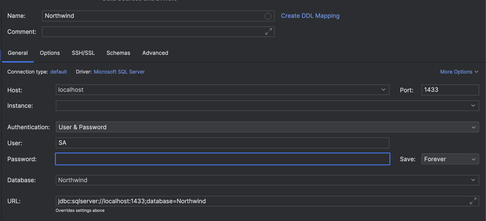
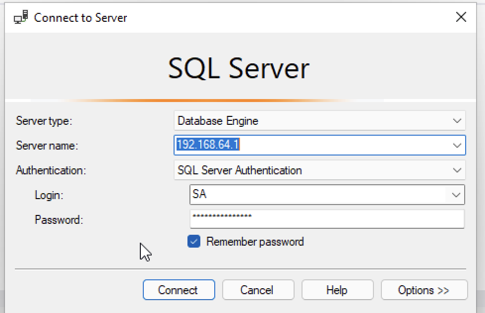

### Building docker image
```
docker build --platform=linux/x86_64 -t sql-server .
```

Run in interactive session
```
docker run -it --platform=linux/x86_64 --rm -p 1433:1433 sql-server
```

### Connecting from DataGrip



Password: QWERasdf1234!

### Connecting from SQL Server Managment Studio



Server address will depend on your VM setup.
Password: QWERasdf1234!